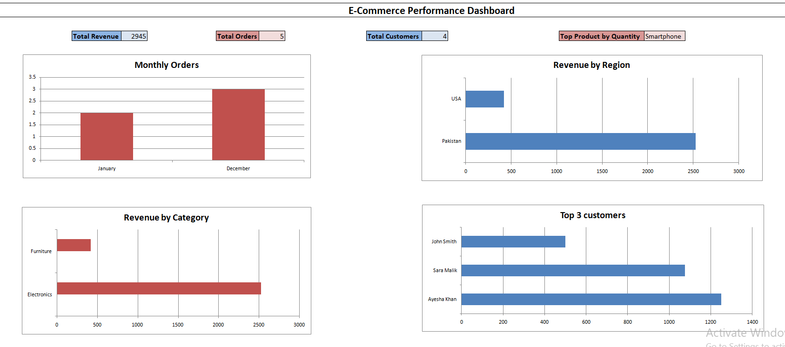

# 🛍️ Ecommerce Sales Dashboard

This project presents an interactive sales dashboard built using **SQL** and **Excel**, designed to analyze and visualize key metrics for an online retail store.

---

## 📂 Project Files

| File Name               | Description                              |
|------------------------|------------------------------------------|
| `Sales_analysis.sql`| SQL queries used for data extraction     |
| `dashboard.xlsx` | Final Excel dashboard with visual KPIs |
| `Dashboard.png`| Screenshot of the dashboard               |

---

## 🧠 Key Insights

- 💰 **Total Revenue**
- 📦 **Total Orders**
- 👥 **Total Customers**
- 🌍 **Revenue by Region**
- 🧾 **Monthly Order Trends**
- 📊 **Revenue by Category**
- 🥇 **Top Product Sold**
- ⭐ **Top 3 Customers**

---

## 📊 Dashboard Preview

---

## ⚙️ Tools Used

- **MySQL Workbench** – for data querying  
- **Excel** – for dashboard creation and visualization

---

## 💡 What I Learned

- Joining multiple tables for business reporting
- Extracting monthly data using SQL date functions
- Creating Excel KPIs and dynamic charts
- Exporting query results from MySQL to Excel

---

## 🔗 Connect with Me

Feel free to connect or give feedback on my [LinkedIn profile](https://www.linkedin.com/in/mahnoor-kashaf/).

